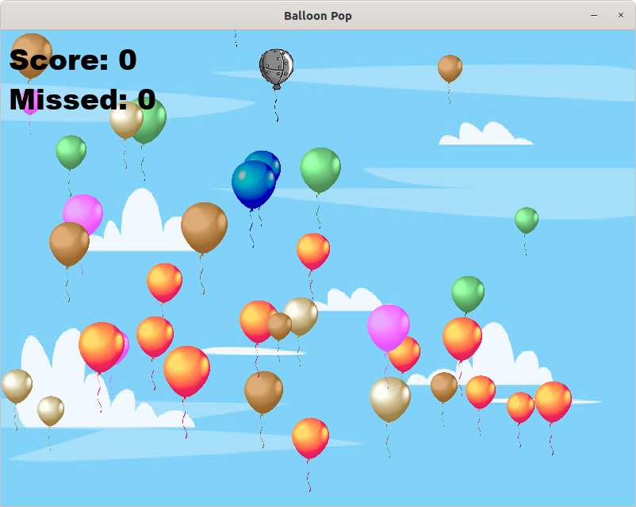
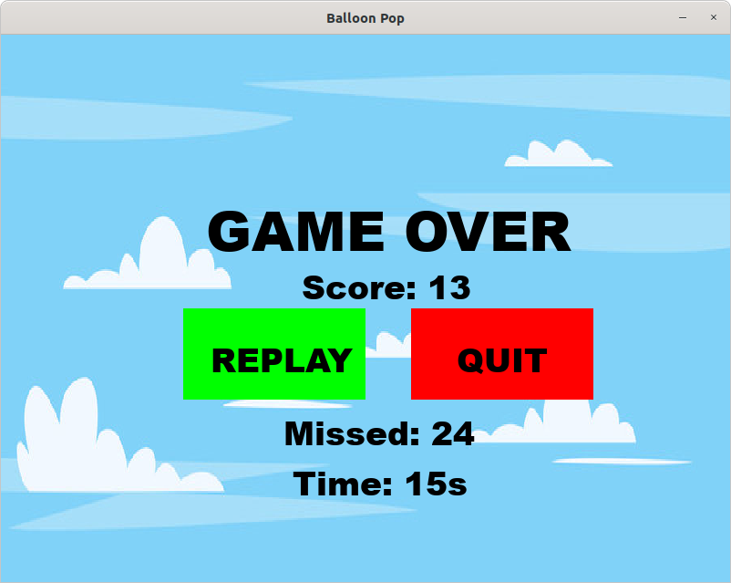

# balloon-pop

Balloon pop game developed with PyGame.

## Installation

1. Clone the repository
2. Install the required packages with `pip install -r requirements.txt`
3. Run the game with `python main.py`

## How to play

Goal: pop as many balloons as possible and avoid the bomb balloon otherwise - game over.

## Screenshots

